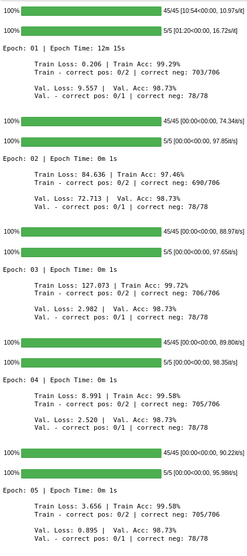

# Training Cancer Nodule Detection on LUNA-16 Dataset using Pytorch

Dataset Used:

[LUNA-16 Lung Cancer Dataset **Kaggle**](https://www.kaggle.com/fanbyprinciple/luna-lung-cancer-dataset)

To Get Dicom Images: [LIDC-IDRI from Cancer Imaging Archives](https://wiki.cancerimagingarchive.net/display/Public/LIDC-IDRI)

Project Description : **To be updated soon**

**5 - Epoch Training Loop**

